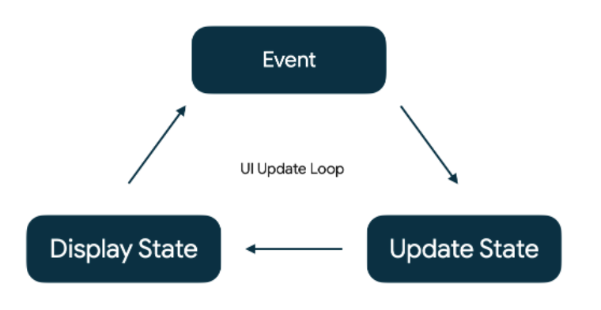

# Wellness State CodeLab

https://developer.android.com/codelabs/jetpack-compose-state#0

## State in Compose

A app's "state" is any value that can change over time. I.e
- the most recent messages received in a chat app
- The user's profile photo
- The scroll position in a list of items

State determines what is shown in the UI at any particular time

## Events

Events are inputs generated from outside or inside an application, such as
- The user interacting with the UI, (pressing a button)
- Other factors, such as sensors reading a new value, or network responses

Events are mechanisms through which the state changes, resulting in changes to the UI



- Event : An event is generated by the user or another part of the program
- Update State : An event handler changes the state that is used by the UI
- Display State : The UI is updated to display the new state

Managing state is Compose is all about understanding how state and events interact with each other

## State in Composable function
Compose apps transform data into UI by calling composable functions.

If a state change happens, Compose re-executes the affected composable functions with the new state, creating an updated UI, this is called recomposition

To be able to do this, Compose need to know what state to track, so that when it receives an update, it can schedule the recomposition

```
Use Compose's State and Mutable States types to make state observable by Compose

```


## State driven UI
Instead of removing UI components or changing their visibility when state changes, we describe how the UI is under specific condition of state.
- If a composable function is called during the initial composition or in recompositions, it is <b>present</b>
- If the function is called inside the ## if ## statement and the condition is not net, it is <b>absent</b>

## Remember in Composition
remember stores objects in the Composition, and forgets the object if the source location where remember is called is not invoked again during a recomposition

remember help to retain state across recomposition, but not retain for re-configuration
- to retain across configuration changes, use <b>rememberSaveable</b>
- to retain state if the item leave the composition entirely

## State Hoisting
- Stateful composable owns state
- Stateless composable doesn't hold any state

State hoisting
- a pattern of moving state to a composable's caller to make a composable stateless
- Single source of truth : moving state instead of duplicating it, we're ensuring there's only one source of truth
- Shareable : Hoisted state can be shared with multiple composables
- Interceptable : Callers to the stateless composables can decide to ignore or modify events before changing the state
- Decoupled: the state for a stateless composable function can be stored anywhere

## State in ViewModel